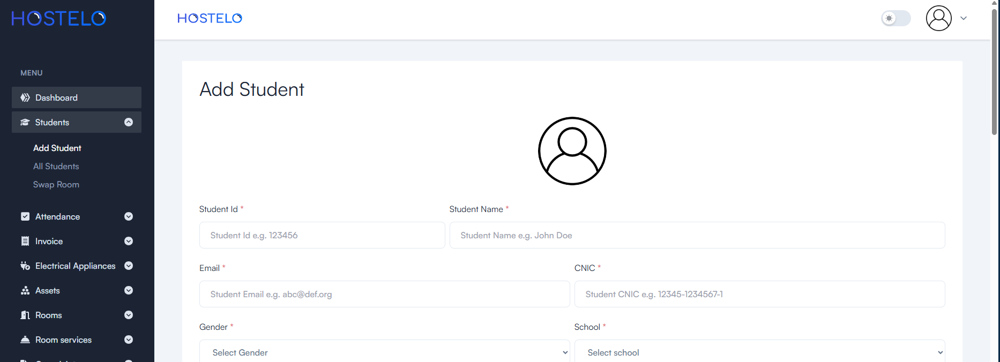

# Hostelo

## Problem

We are assigned to create a hostel management system for our university hostels. The system should be able to manage the students and the rooms in the hostel. The system should be able to add new students, add new rooms, assign students to rooms, and print the list of students in a room. The system should also be able to print the list of students in the hostel.

Along with these, the system should also be able to generate the invoices for the students. The invoice should contain the details of the student, the room rent, the electricity bill, the mess bill, and the total amount to be paid by the student.

We are supposed to use the concepts of Relational Database Management System (RDBMS) to create the system. We are asked to create GUI for the system to which the students and manager would interact.

## Solution

The solution to the problem is to use Next.js and MySQL to create the system. The system would be a web application that would be hosted on the university's server. The students and the manager would interact with the system using the web application.

The system would have two types of users: students and manager. The students would be able to view their details, view their room details, and view their invoice. The manager would be able to add new students, add new rooms, assign students to rooms, and print the list of students in a room. The manager would also be able to print the list of students in the hostel.

The system would also be able to generate the invoices for the students. The invoice would contain the details of the student, the room rent, the electricity bill, the mess bill, and the total amount to be paid by the student.

Manager would be able to switch rooms of the students. The manager would also be able to see which students have not paid their bills. And he can mail the students right from the system.

## Tools

- Next.js
- MySQL
- Tailwind CSS
- Fast API

## Developers

- Muhammad Hamza ([profile](https://github.com/CodeWhizHamza))
- Ahmed Mohiuddin Shah ([profile](https://github.com/Ahmed-Mohiuddin-Shah))
- Aqsa Batool ([profile](https://github.com/WhizAqsa))

## How to run

- Create a .env file inside the api folder
- Inside the .env folder paste the following

```bash
NEXT_PUBLIC_API_BASE_URL = "localhost:3000"
```

- Then run by using the following commands

```bash
npm install
npm run dev (for development)
npm run build && npm run start (for production)
```

## How to Configure and Run API Server

- Create a .env file inside the api folder
- Inside the .env folder paste the following:

  ```bash
  mySQLServerIP = "0.0.0.0"
  apiUserName = "dummyValue"
  apiPassword = "dummyValue"

  email_name = "dummyEmail@gmail.com"
  email_password = "password"

  secret = veryDummyKey
  algorithm = HS256

  SALT = "Your Salt generated by using bcrypt.gensalt()"
  ```

- Then replace the dummy values with your own
- Then run the main.py file in the api folder file using following command:
  ```bash
  python main.py
  ```

## Screenshots





